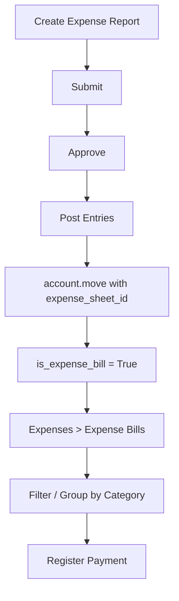

# Ceres Expense Bills Management

Odoo **18.0 Community Edition** addon that separates **expense-related accounting bills** from **supplier vendor bills**. Fully compatible with **Odoo 18 Enterprise** (no Enterprise-only dependencies).

| Item | Value |
|------|--------|
| Technical name | `ceres_expense_bills_management` |
| Edition | Odoo 18 Community Edition (Enterprise compatible) |
| Dependencies | `hr_expense`, `account` (Community modules only) |

## Edition compatibility

| Edition | Supported |
|---------|-----------|
| Odoo 18 Community | Yes (primary target) |
| Odoo 18 Enterprise | Yes (fully compatible) |

This module depends only on `hr_expense` and `account`, which are available in both Community and Enterprise. It does not require any Enterprise-only apps such as `account_accountant` or `hr_payroll`.

## Overview

In Odoo 18, when an **Expense Report** (`hr.expense.sheet`) is approved and posted, Odoo creates `account.move` records for employee reimbursements or company-paid expenses. Employee reimbursements use vendor bills (`in_invoice`). Those records appear in **Accounting > Vendors > Bills** together with normal supplier invoices.

This module tags those moves as **Expense Bills**, shows them under **Expenses > Expense Bills**, and excludes them from the standard Vendor Bills list. Posting, payments, reconciliation, and reports are unchanged.

## Business problem

- Expense reimbursement bills are mixed with supplier invoices
- Hard to filter payables by expense category (Travel, Food, Fuel, etc.)
- Finance teams need separate views without duplicate accounting
- Reimbursement tracking and vendor AP management should stay separate

## Solution

- Identifies accounting records generated through the Expenses workflow
- Adds **Expenses > Expense Bills** menu and action
- Excludes expense bills from **Accounting > Vendors > Bills**
- Supports dynamic category filtering and grouping (no hardcoded categories)
- Uses stored fields and database domains for performance
- Preserves all standard Odoo accounting behavior

## Standard Odoo workflow (before install)

```
Expense lines -> Expense Report -> Submit -> Approve -> Post Entries
                                                          |
                                                          v
                                    Accounting > Vendor Bills (mixed list)
```

## Expense Bills workflow (after install)



## Vendor Bills workflow (unchanged)

```
Vendor Bill Created -> Accounting > Vendor Bills -> Post -> Register Payment
```

After install, the Vendor Bills list excludes records where `is_expense_bill = True`.

## How Expense Bills are identified

**Inspected source:** Odoo 18 `hr_expense` and `account` modules.

### Relationship (Odoo 18)

| Model | Field | Target |
|-------|-------|--------|
| `hr.expense.sheet` | `account_move_ids` | `account.move` |
| `account.move` | `expense_sheet_id` | `hr.expense.sheet` |
| `hr.expense` | `sheet_id` | `hr.expense.sheet` |
| `hr.expense` | `product_id` | Expense Category (`can_be_expensed=True`) |

When an expense report is posted, `hr.expense.sheet._prepare_move_vals()` sets:

```python
'expense_sheet_id': self.id
```

on the created `account.move`. Standard Odoo uses this field for the expense report smart button, payment hooks, and move constraints.

### Identification rule

```python
is_expense_bill = bool(move.expense_sheet_id)
```

This is reliable because:

- Only the Expenses workflow sets `expense_sheet_id` on vendor moves
- Manually created vendor bills have empty `expense_sheet_id`
- We do **not** use journal name, partner, or `move_type` alone

### Move types from Expense Reports (Odoo 18)

| Payment mode | Typical `move_type` | Created via |
|--------------|---------------------|-------------|
| Employee (to reimburse) | `in_invoice` | `_prepare_bills_vals()` |
| Company | `entry` | `_prepare_payments_vals()` via payment |

Both are flagged as Expense Bills when `expense_sheet_id` is set.

## Expense category filtering

### Standard category field

On `hr.expense`, the Expense Category is:

```python
product_id = fields.Many2one('product.product', domain=[('can_be_expensed', '=', True)])
```

### Multiple categories per bill

One expense report may contain several lines with different categories (e.g. Travel + Food + Accommodation on one report).

**Strategy (Option A):** stored Many2many `expense_category_ids`:

```python
expense_category_ids = expense_sheet_id.expense_line_ids.product_id
```

- Filter: `('expense_category_ids', 'in', category_id)`
- Group by: a bill with 3 categories may appear in 3 groups (correct for analysis)
- No misleading single `Many2one` category field

## Menu changes

| Location | Action | Domain |
|----------|--------|--------|
| Expenses > Expense Bills | `action_expense_bills` | `[('is_expense_bill', '=', True)]` |
| Accounting > Vendors > Bills | Standard actions | `move_type in ('in_invoice', 'in_refund')` AND `is_expense_bill = False` |

## Accounting compatibility

- Same `account.move` records (no duplicate model)
- Draft / Post / Reset to draft: unchanged
- Register Payment: unchanged (`action_register_payment` on expense sheet)
- `payment_state`, reconciliation, journal items: unchanged
- Accounting reports: unchanged (same underlying moves)

## Multi-company

- `account.move` company rules apply unchanged
- `is_expense_bill` and category fields are computed per move from the linked expense sheet
- No cross-company data exposure beyond standard Odoo record rules

## Security

No new ACL rules are required. The module extends `account.move` only.

| Control | Implementation |
|---------|----------------|
| Expense Bills menu | `hr_expense.group_hr_expense_user` AND `account.group_account_readonly` |
| Record access | Standard `account.move` access rights |
| Create from menu | Disabled (`create: False` on action) |

Users who could not access accounting moves before installation are not granted broader access.

## Installation

1. Copy `ceres_expense_bills_management` to your addons path
2. Update the Apps list
3. Install **Ceres Expense Bills Management**

```bash
python3.10 odoo-bin --addons-path=addons,ceres \
  -d TEST_DB -i ceres_expense_bills_management \
  --test-tags ceres_expense_bills_management --stop-after-init
```

## Configuration

No extra configuration is required after installation.

Expense categories are the standard **Expenses > Configuration > Expense Categories** products (`can_be_expensed=True`). They appear in the Expense Bills search bar and Group By options.

## Usage

1. Create expense lines and submit an Expense Report (standard Odoo flow).
2. Approve the report and click **Post Entries**.
3. Open **Expenses > Expense Bills** to see the generated accounting record(s).
4. Use the **Expense Category** search field or filters to narrow the list.
5. Use **Group By > Expense Category** for category-wise analysis.
6. Open a bill and use **Register Payment** as usual.
7. Confirm **Accounting > Vendors > Bills** shows only supplier/vendor bills.

## Technical architecture

### Models extended

- `account.move`

### Fields added

| Field | Type | Purpose |
|-------|------|---------|
| `is_expense_bill` | Boolean, stored, indexed | Classification flag |
| `expense_category_ids` | Many2many `product.product` | Multi-category filter/group |
| `expense_employee_ids` | Many2many `hr.employee` | Employee group-by |

### Views / actions

| File | Purpose |
|------|---------|
| `views/expense_bill_views.xml` | List, search, action for Expense Bills |
| `views/account_move_views.xml` | Form fields, vendor bill domain exclusions |
| `views/menu.xml` | Expenses > Expense Bills menu |

### Vendor bill actions modified

- `account.action_move_in_invoice_type`
- `account.action_move_in_invoice`
- `account.action_move_in_refund_type`

### Post-install hook

`hooks.post_init_hook` backfills stored fields on existing moves linked to expense reports.

## Performance considerations

- `is_expense_bill` is stored and indexed for fast SQL domains
- Category and employee relations are stored Many2many (no Python filtering in list views)
- Vendor bill exclusion uses database domain, not client-side filtering
- Category filtering uses search field and filter/group-by (Odoo search panel supports only many2one/selection, not many2many)

## Known limitations

- Odoo search panel does not support many2many fields; category filtering uses search bar and Group By instead
- Grouping by category may list the same bill under multiple categories when the report has multiple lines
- Company-paid expenses (`entry` type) appear in Expense Bills but not in Vendor Bills
- If Odoo clears `expense_sheet_id` on cancel (standard `button_cancel` behavior), `is_expense_bill` becomes False and the record may reappear under Vendor Bills until reprocessed

## Author / support

| | |
|---|---|
| Company | Ceres - IT Solution |
| Website | https://www.ceresitsolution.com/ |
| Email | info@ceresitsolution.com |

## License

LGPL-3
